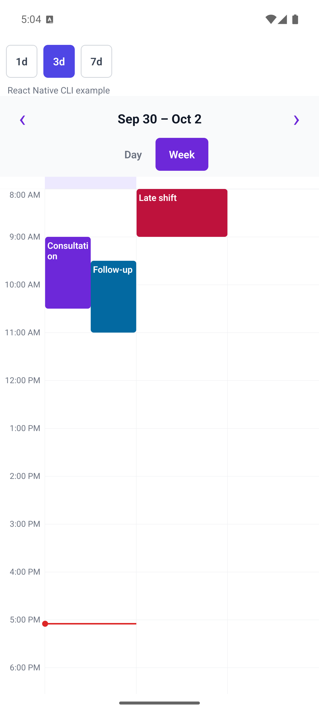

# @mujtababhatti2/react-native-full-calendar

A controlled, timezone-aware day and week calendar for React Native. The beta supports Android and iOS, timed events, overlap layout, compact week ranges, slot and event presses, themes, and custom renderers. It contains no native module and works in Expo and bare React Native CLI apps.

## Preview



## Installation

```sh
npm install @mujtababhatti2/react-native-full-calendar temporal-polyfill
```

`react` and `react-native` are peer dependencies. The beta targets React Native 0.76 or newer.

## Usage

```tsx
import { useState } from 'react';
import {
  FullCalendar,
  type CalendarEvent,
} from '@mujtababhatti2/react-native-full-calendar';

type Appointment = { patientId: string };

const events: CalendarEvent<Appointment>[] = [
  {
    id: 'appointment-1',
    title: 'Consultation',
    patientId: 'patient-42',
    start: '2026-09-30T09:00:00+05:00',
    end: '2026-09-30T10:00:00+05:00',
  },
];

export function Schedule() {
  const [date, setDate] = useState('2026-09-30');
  const [view, setView] = useState<'day' | 'week'>('week');

  return (
    <FullCalendar
      events={events}
      date={date}
      view={view}
      timeZone="Asia/Karachi"
      firstDayOfWeek={1}
      visibleDays={3}
      startHour={8}
      endHour={20}
      onDateChange={setDate}
      onViewChange={setView}
      onEventPress={(event) => console.log(event.patientId)}
      onSlotPress={(slot) => console.log(slot.start, slot.end)}
    />
  );
}
```

The calendar is controlled: it never changes `date`, `view`, or `events` internally. Navigation and view controls request changes through callbacks. The consuming app owns persistence, booking confirmation, conflict checks, optimistic updates, and rollback.

## API

### Required props

| Prop           | Type                          | Meaning                                      |
| -------------- | ----------------------------- | -------------------------------------------- |
| `events`       | `readonly CalendarEvent<T>[]` | Timed events with stable IDs                 |
| `date`         | `YYYY-MM-DD`                  | Controlled calendar date in `timeZone`       |
| `view`         | `'day' \| 'week'`             | Controlled view                              |
| `timeZone`     | IANA timezone                 | Timezone used for ranges, labels, and layout |
| `onDateChange` | `(date) => void`              | Receives navigation requests                 |

### Configuration and callbacks

| Prop                        | Default            | Meaning                                                          |
| --------------------------- | ------------------ | ---------------------------------------------------------------- |
| `visibleDays`               | `7`                | `1`, `3`, or `7` columns in week view                            |
| `firstDayOfWeek`            | `0`                | Sunday (`0`) through Saturday (`6`); applies to seven-day ranges |
| `startHour` / `endHour`     | `0` / `24`         | Visible whole-hour range                                         |
| `slotDurationMinutes`       | `30`               | Slot size and touch snapping interval                            |
| `hourHeight`                | `64`               | Density in logical pixels per elapsed hour                       |
| `scrollToTime`              | start hour         | Initial `HH:mm` scroll position after date/view changes          |
| `locale`                    | `en-US`            | Locale passed to `Intl.DateTimeFormat`                           |
| `dateFormat` / `timeFormat` | localized defaults | `Intl.DateTimeFormatOptions` overrides                           |
| `onViewChange`              | —                  | Receives day/week control presses                                |
| `onEventPress`              | —                  | Receives the original event, including custom fields             |
| `onSlotPress`               | —                  | Receives an exclusive ISO instant interval                       |
| `theme`                     | system light/dark  | Partial `CalendarTheme` override                                 |
| `renderEvent`               | built-in card      | Custom event content rendered inside the positioned card         |
| `renderHeader`              | built-in header    | Custom navigation and view header                                |
| `emptyState`                | `No events`        | Content shown when the visible range has no timed events         |

Seven-day ranges contain the controlled date and align to `firstDayOfWeek`. One- and three-day week ranges start on `date`. Previous and next advance by the visible column count.

## Event and timezone rules

Event `start` and `end` must be ISO timestamps ending in `Z` or an explicit offset such as `+05:00`. Event ends are exclusive, so an event ending at 10:00 does not overlap one starting at 10:00. Invalid timestamps, duplicate or missing IDs, and non-positive ranges are skipped; development builds warn with the affected ID.

The package uses `temporal-polyfill` behind its date adapter. Calendar dates are interpreted in `timeZone`, while events remain exact instants. A missing local time during a spring-forward transition moves to the next valid instant. A repeated local time remains tied to the explicit offset in the event timestamp. Layout height uses actual elapsed time, so a range spanning a timezone transition can be shorter or longer than its wall-clock labels suggest. Local days are never assumed to last 24 hours.

Events intersecting the visible interval are included and clipped to its day and hour boundaries. Cross-midnight events render as separate visual segments. Pressing any segment returns the unchanged original event.

## Customization

```tsx
<FullCalendar
  {...props}
  theme={{ primary: '#4F46E5', gridLine: '#E5E7EB' }}
  renderEvent={({ event, startsBefore, endsAfter }) => (
    <AppointmentCard event={event} continued={startsBefore || endsAfter} />
  )}
  renderHeader={({ label, previous, next, today, view, setView }) => (
    <ScheduleHeader {...{ label, previous, next, today, view, setView }} />
  )}
/>
```

Built-in events expose useful screen-reader labels, text scaling limits, and button roles. Headers and day columns mirror when React Native's RTL setting is enabled. Custom renderers are responsible for the accessibility of their own content, while the surrounding event button retains its generated label.

## Development and beta release

```sh
corepack yarn install
corepack yarn typecheck
corepack yarn lint
corepack yarn test
corepack yarn build
corepack yarn example:expo start
corepack yarn example:cli start
corepack yarn example:cli bundle:android
corepack yarn example:cli bundle:ios
npm pack --dry-run
npm publish --tag beta --access public
```

Before publishing, confirm that the `@mujtababhatti2` npm scope exists, the scoped name is available, and the packed tarball contains only the documented public files. See [PERFORMANCE.md](./PERFORMANCE.md) for the Android profiling procedure.

The Expo app lives in `example/`. A separate generated React Native CLI app with native Android and iOS projects lives in `example-cli/`; see its README for SDK, CocoaPods, and run instructions.

## Beta limitations

This release supports timed day and week views on Android and iOS. Month, agenda, all-day rows, drag and resize, swipe navigation, recurring-event expansion, resources, availability overlays, booking rules, and React Native Web are planned separately.

## License

MIT
